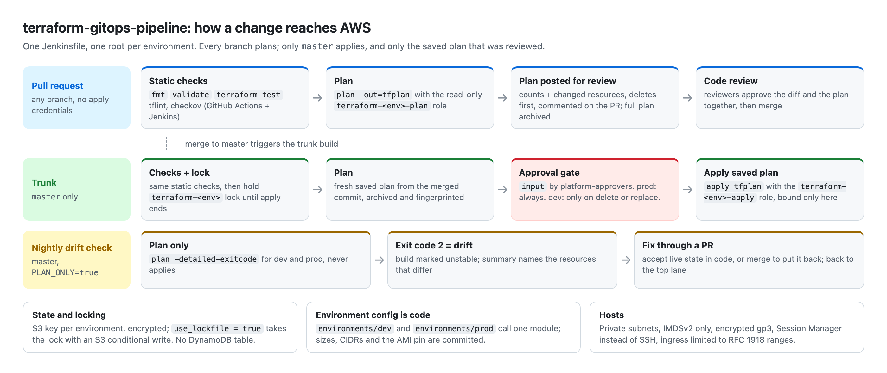
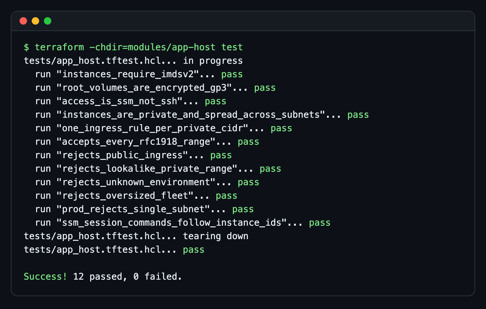
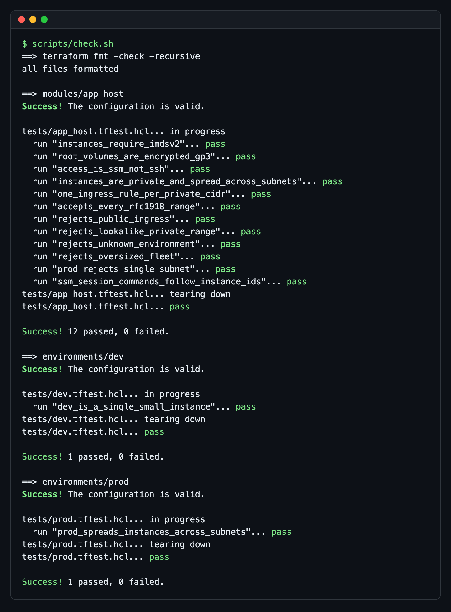
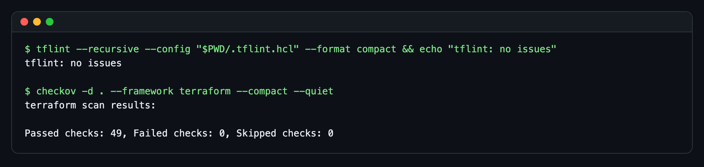
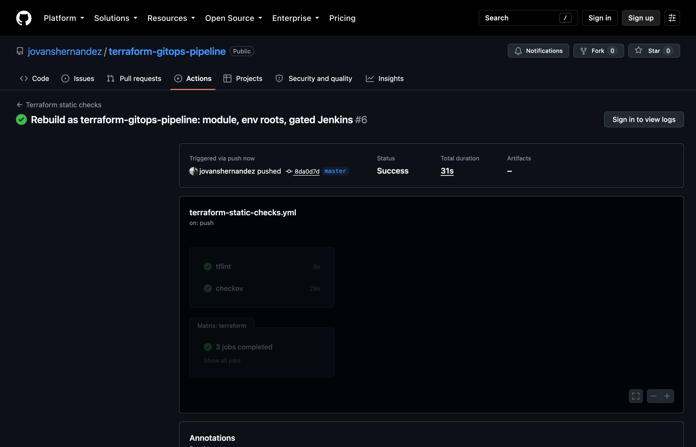

# terraform-gitops-pipeline

[](https://github.com/jovanshernandez/terraform-gitops-pipeline/actions/workflows/terraform-static-checks.yml)

A reference for delivering Terraform the GitOps way: every change is a pull
request, every pull request gets static checks and a saved plan posted for
review, and only the trunk branch can apply, one environment at a time, behind
an approval gate. It pairs a Jenkins declarative pipeline (plan, approve, apply)
with GitHub Actions (offline checks on every PR), and a small hardened EC2
module with a root per environment. The pipeline and tests run here; the stack
has not been applied to a live AWS account.





## The problem

Terraform run from laptops drifts: people apply unreviewed plans, apply from
feature branches, race each other on the same state, and nobody notices when the
live environment stops matching the code. This repo shows the controls that fix
that, in a form small enough to read in one sitting:

- Plans are produced by the pipeline, saved, and reviewed before anything runs.
- Only `master` applies, and it applies the exact saved plan that was approved.
- prod always needs a named approver; dev needs one when a plan deletes or replaces.
- Plan and apply use different credentials, and the apply credentials only exist
  in the Apply stage.
- A nightly plan-only run flags drift between `master` and what is deployed.

## Features

- **Jenkinsfile** (declarative): `ENVIRONMENT` and `PLAN_ONLY` parameters; parallel
  fmt/validate/test, tflint and checkov stages; `terraform plan -out` with
  `-detailed-exitcode`; plan text, summary and binary archived; summary commented
  on the PR; `input` approval restricted to `platform-approvers`; apply only on
  `master`; per-environment lockable resource held from plan to apply; build
  timeout, input timeout and workspace cleanup.
- **GitHub Actions**: `fmt -check`, `validate` with `-backend=false` and
  `terraform test` for each root, plus tflint (with the AWS ruleset) and checkov.
  No AWS credentials are needed or available.
- **State**: S3 backend with the native lockfile (`use_lockfile = true`), one state
  key per environment. No DynamoDB lock table.
- **Module `app-host`**: EC2 in private subnets with IMDSv2 required (hop limit 1),
  encrypted gp3 root volumes, an instance role for Session Manager instead of SSH
  keys, app-port ingress only from RFC 1918 ranges, HTTPS-only egress.
- **Validation in the code**: typed variables reject public ingress CIDRs, unknown
  environments, malformed IDs, unapproved instance families and oversized fleets;
  a precondition stops a prod plan that would put every instance in one subnet.
- **Plan summary**: `scripts/plan-summary.sh` turns `terraform show -json` into a
  Markdown table and lists deletes and replacements first.

## Control model

| Question | Answer |
| --- | --- |
| Who can apply? | Only the Jenkins Apply stage, only on `master`, with the `terraform-<env>-apply` credential. People plan with read-only access. |
| Where do approvals happen? | Twice: PR review in GitHub (code and posted plan together), then the Jenkins `input` gate before apply. prod always stops there; dev stops when the plan is destructive. |
| How is the plan reviewed? | The PR gets a comment with counts and every changed resource; the full `tfplan.txt` is a build artifact. The applied file is the saved plan from the same build. |
| What stops two applies racing? | The S3 lockfile on state, plus a Jenkins `lock` per environment held from plan through apply. |
| How is drift found? | Scheduled `PLAN_ONLY=true` builds on `master`. Exit code 2 from `-detailed-exitcode` marks the build unstable and the summary lists what differs. |

Details: [docs/control-model.md](docs/control-model.md). Reviewer checklist:
[docs/review-checklist.md](docs/review-checklist.md).

## Quick start

Requirements: Terraform 1.10 or newer (developed on 1.16.0). tflint, checkov and
jq are optional locally and required on the Jenkins agent.

Run every offline check (fmt, validate, `terraform test`) without AWS credentials:

```bash
scripts/check.sh
```

Or one root at a time:

```bash
terraform -chdir=modules/app-host init -backend=false
terraform -chdir=modules/app-host test
```

Lint and scan:

```bash
tflint --init
tflint --recursive --config "$PWD/.tflint.hcl" --format compact
checkov -d . --framework terraform --compact --quiet
```

Plan against a real account (needs AWS credentials, an S3 state bucket, and a VPC
tagged `Name=platform-dev` with subnets tagged `Tier=private`):

```bash
cp environments/dev/backend.hcl.example environments/dev/backend.hcl   # set your bucket
terraform -chdir=environments/dev init -backend-config=backend.hcl
terraform -chdir=environments/dev plan -out=tfplan
terraform -chdir=environments/dev show -json tfplan > tfplan.json
scripts/plan-summary.sh tfplan.json dev
```

### Jenkins setup

- Multibranch Pipeline job on this repo, agents labelled `terraform` with
  terraform, tflint, checkov and jq installed.
- Global environment variable `TF_STATE_BUCKET`.
- AWS credentials `terraform-dev-plan`, `terraform-dev-apply`,
  `terraform-prod-plan`, `terraform-prod-apply` (CloudBees AWS Credentials).
- A `platform-approvers` group for the prod gate.
- Plugins: Pipeline, GitHub Branch Source, Pipeline: GitHub, Credentials Binding,
  CloudBees AWS Credentials, Lockable Resources, Parameterized Scheduler,
  Workspace Cleanup, AnsiColor, Timestamper, JUnit.
- Branch protection on `master` requiring the GitHub Actions checks and a review.

## Design notes

- **A root per environment, one shared module.** `environments/dev` and
  `environments/prod` are thin roots that call `modules/app-host`. Everything that
  differs between environments is committed in each root's `main.tf`, so promoting
  a change to prod is a visible diff, not a different `.tfvars` file on someone's
  machine. Each root has its own state key and lock.
- **S3 native locking over DynamoDB.** Terraform 1.10 added lockfiles to the S3
  backend using conditional writes, and DynamoDB locking is deprecated. One fewer
  resource to provision and grant. To migrate an existing stack, set both
  `use_lockfile` and `dynamodb_table` for one release, then drop the table.
- **Saved plans only.** Apply never re-plans. What the approver saw is what runs,
  and the Jenkins lock means nothing else can change the environment in between.
- **Network is someone else's stack.** The roots look up the VPC and private
  subnets by tag, so this stack cannot modify networking.
- **AMI is pinned by name.** Bumping it is a pull request whose plan shows the
  instance replacement, instead of a silent change the next time the latest AMI
  moves.
- **No SSH.** No key pair, no port 22; operators use `aws ssm start-session`
  (the roots output the command for each instance).

## Testing

`terraform test` runs with `mock_provider "aws"`, so it needs no credentials and
makes no API calls. The module suite (12 runs) asserts IMDSv2, encrypted gp3,
Session Manager wiring, no port 22, private placement across subnets, one rule per
CIDR and HTTPS-only egress, and checks that bad input fails: public or look-alike
private CIDRs, unknown environments, oversized fleets, and prod on a single
subnet. Each environment root has its own test with mocked data sources that
checks its committed sizing and subnet spread.





The same checks on GitHub Actions for the commit that added them:



## Project layout

```text
.
├── Jenkinsfile                       # plan on every branch, gated apply on master
├── .github/workflows/
│   └── terraform-static-checks.yml   # fmt, validate, test, tflint, checkov on PRs
├── .tflint.hcl                       # tflint config with the AWS ruleset
├── modules/app-host/                 # hardened EC2 service module
│   └── tests/app_host.tftest.hcl     # mocked-provider unit tests
├── environments/
│   ├── dev/                          # dev root: settings, backend key, test
│   └── prod/                         # prod root: settings, backend key, test
├── scripts/
│   ├── check.sh                      # offline fmt + validate + test for all roots
│   └── plan-summary.sh               # Markdown summary of a saved plan
└── docs/
    ├── control-model.md              # gates, credentials, locking, drift
    ├── review-checklist.md           # what to check before approving
    ├── gitops-flow.html              # source of the flow diagram
    └── images/                       # screenshots used in this README
```

## License

MIT. See [LICENSE](LICENSE).
